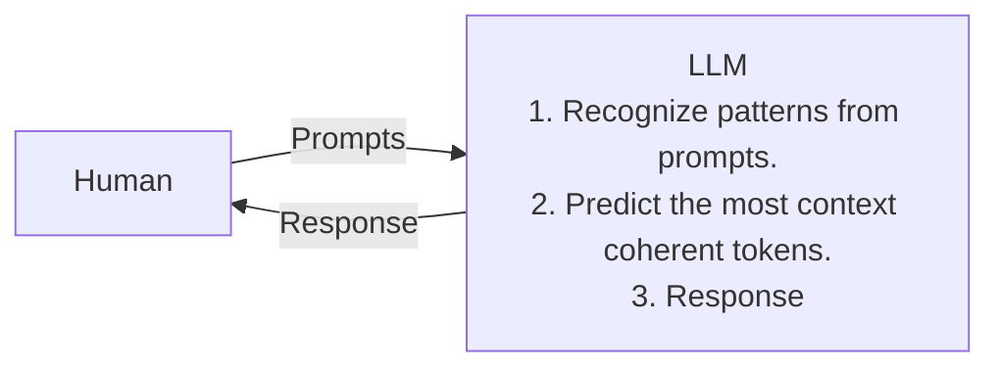
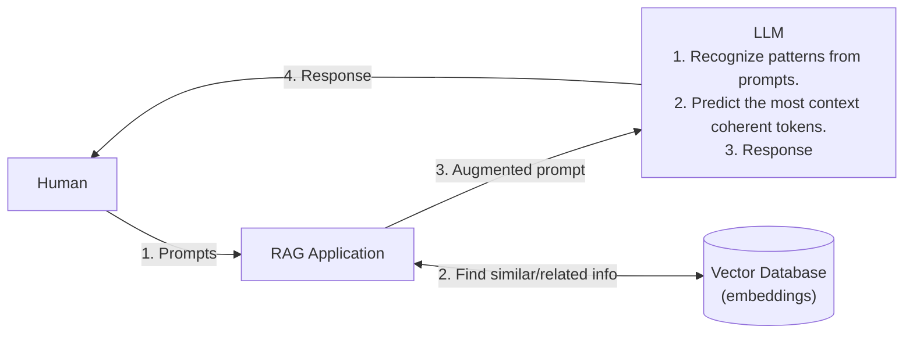
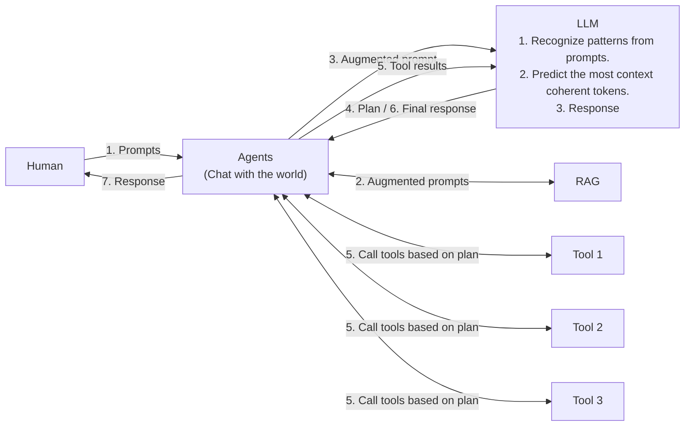
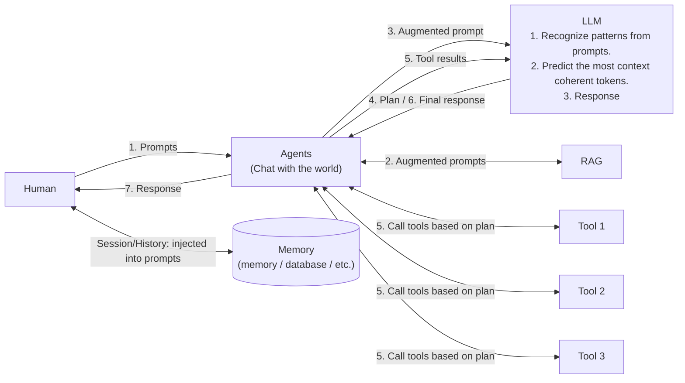
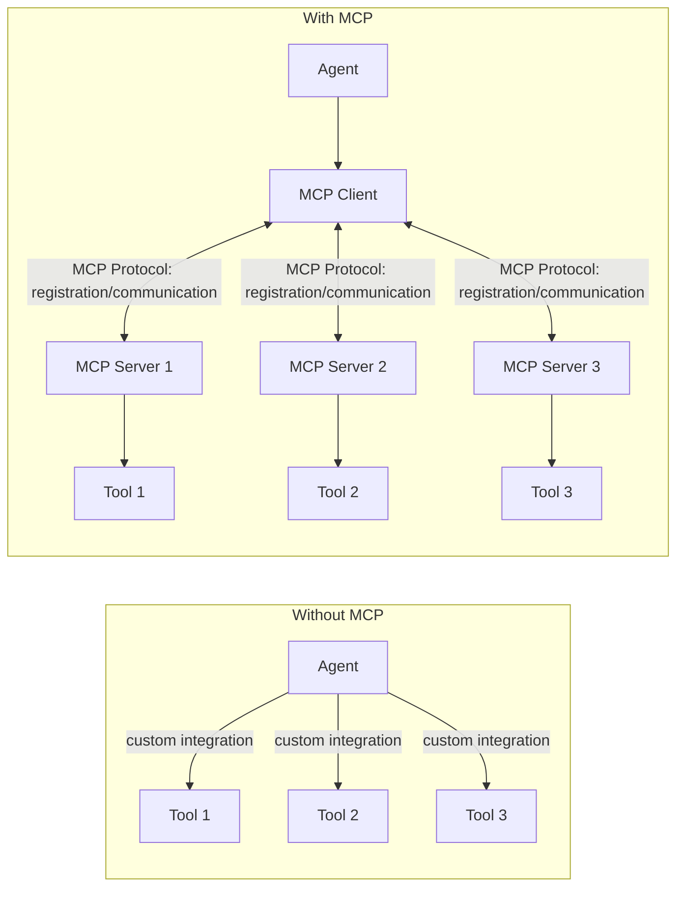
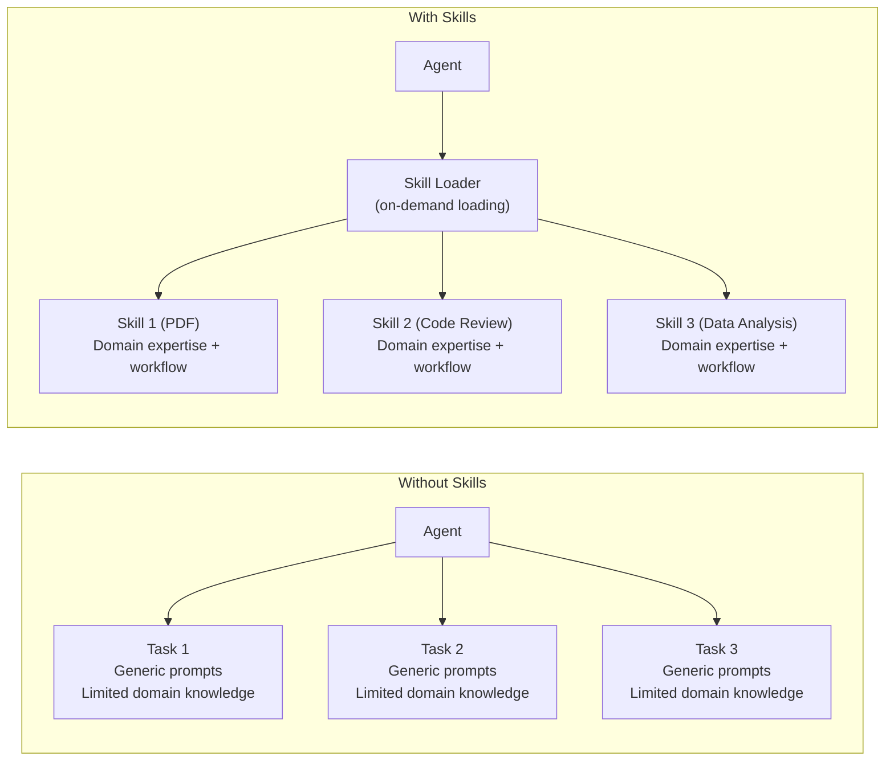
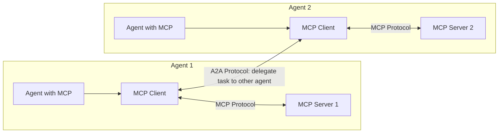

# AI Introduction

## LLM

### Bare LLM

**ISSUES**:

1. Stateless: every request is a fresh request.
2. No external/new knowledge: only has knowledge before the date it gets trained.
3. Static: only supports text generation related tasks.

### +RAG

**MITIGATION**:

1. External knowledge: partially solved.
2. Context: augmented.

**ISSUES**:

1. Stateless.
2. Static.

### +Agents

**MITIGATION**:

1. External knowledge: solved.
2. Context: augmented and filtered (guardrail).
3. Active: able to take actions.

**ISSUES**:

1. Stateless.

### +Memory

**MITIGATION**:

1. External knowledge: solved.
2. Context: augmented and filtered (guardrail).
3. Active: able to take actions.
4. Stateful: keep track of your conversations.

## Protocols for LLM and Agents, Tools

### MCP

**PROBLEM SOLVED**: provides a unified and standard mechanism to encapsulate tools and make it easy for agents to call tools (through MCP servers).

### Skills

**PROBLEM SOLVED**: provide reusable, domain-specific prompt templates that extend agent capabilities for specialized tasks without requiring new tools or MCP servers.

### A2A

**PROBLEM SOLVED**: provide a unified and standard mechanism to enable agents to communicate and delegate tasks to each other.

