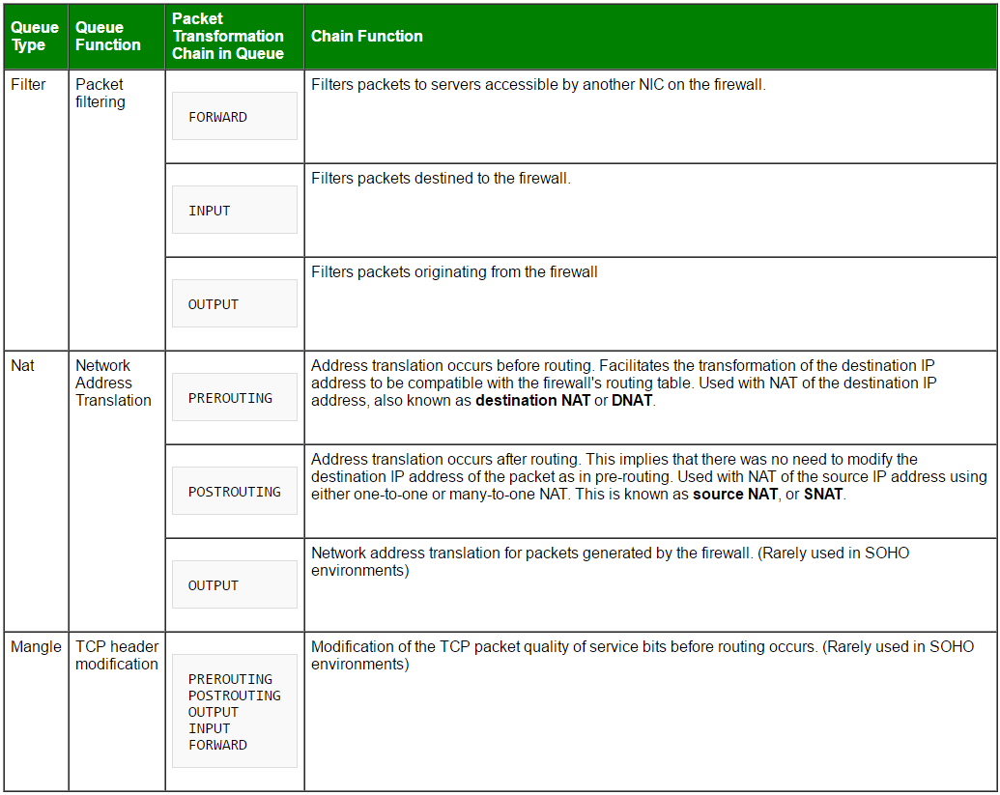
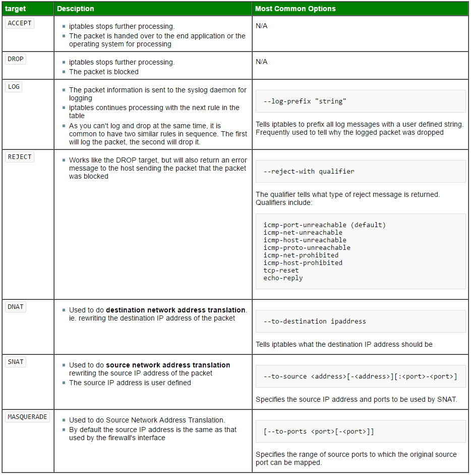
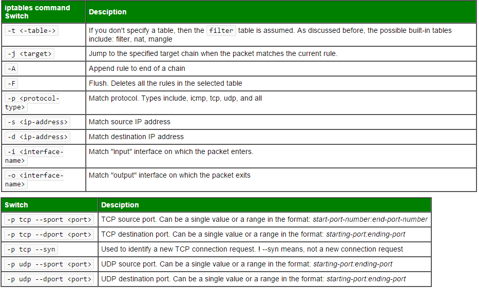

.. contents:: iptables Tips

========
iptables
========

Package Flow
------------

.. image:: images/linux_os_net/iptables_pflow.jpg

Tables and Chains
-----------------

Targets and Jumps
-----------------

Match Criterias
---------------

Reset Rules
-----------

::

  iptables -F
  iptables -X
  iptables -t nat -F
  iptables -t nat -X
  iptables -t mangle -F
  iptables -t mangle -X
  iptables -t raw -F
  iptables -t raw -X
  iptables -t security -F
  iptables -t security -X
  iptables -P INPUT ACCEPT
  iptables -P FORWARD ACCEPT
  iptables -P OUTPUT ACCEPT

Save and Restore Rules
----------------------

::

  iptables-save > /etc/iptables/iptables.rules
  iptables-restore < /etc/iptables/iptables.rules

Query
-----

::

  iptables -nvL [--line-numbers] [-t <table name>]

Delete
-------

::

  # Add a rule
  iptables -A INPUT -p tcp --dport 5001 -j ACCEPT
  # Delete the same rule
  iptables -D INPUT -p tcp --dport 5001 -j ACCEPT

Insert
-------

::

  # Get the rule index num.
  iptables -nvL --line-numbers
  # Insert a rule
  iptables -I INPUT <rule index num. to insert this rule before> -p tcp --dport 5001 -j ACCEPT

Comment
--------

::

  iptables -A INPUT -p tcp --dport 5001 -j ACCEPT -m comment --comment 'test rule'

Sample Rules
------------

::

  # Delete all existing rules
  iptables -F

  # Set default chain policies
  iptables -P INPUT DROP
  iptables -P FORWARD DROP
  iptables -P OUTPUT DROP

  # Block a specific ip-address
  BLOCK_THIS_IP="x.x.x.x"
  iptables -A INPUT -s "$BLOCK_THIS_IP" -j DROP

  # Allow ALL incoming SSH
  iptables -A INPUT -i eth0 -p tcp --dport 22 -m state --state NEW,ESTABLISHED -j ACCEPT
  iptables -A OUTPUT -o eth0 -p tcp --sport 22 -m state --state ESTABLISHED -j ACCEPT

  # Allow incoming SSH only from a sepcific network
  iptables -A INPUT -i eth0 -p tcp -s 192.168.200.0/24 --dport 22 -m state --state NEW,ESTABLISHED -j ACCEPT
  iptables -A OUTPUT -o eth0 -p tcp --sport 22 -m state --state ESTABLISHED -j ACCEPT

  # Allow incoming HTTP
  iptables -A INPUT -i eth0 -p tcp --dport 80 -m state --state NEW,ESTABLISHED -j ACCEPT
  iptables -A OUTPUT -o eth0 -p tcp --sport 80 -m state --state ESTABLISHED -j ACCEPT

  # Allow incoming HTTPS
  iptables -A INPUT -i eth0 -p tcp --dport 443 -m state --state NEW,ESTABLISHED -j ACCEPT
  iptables -A OUTPUT -o eth0 -p tcp --sport 443 -m state --state ESTABLISHED -j ACCEPT

  # MultiPorts (Allow incoming SSH, HTTP, and HTTPS)
  iptables -A INPUT -i eth0 -p tcp -m multiport --dports 22,80,443 -m state --state NEW,ESTABLISHED -j ACCEPT
  iptables -A OUTPUT -o eth0 -p tcp -m multiport --sports 22,80,443 -m state --state ESTABLISHED -j ACCEPT

  # Allow outgoing SSH
  iptables -A OUTPUT -o eth0 -p tcp --dport 22 -m state --state NEW,ESTABLISHED -j ACCEPT
  iptables -A INPUT -i eth0 -p tcp --sport 22 -m state --state ESTABLISHED -j ACCEPT

  # Allow outgoing SSH only to a specific network
  iptables -A OUTPUT -o eth0 -p tcp -d 192.168.101.0/24 --dport 22 -m state --state NEW,ESTABLISHED -j ACCEPT
  iptables -A INPUT -i eth0 -p tcp --sport 22 -m state --state ESTABLISHED -j ACCEPT

  # Allow outgoing HTTPS
  iptables -A OUTPUT -o eth0 -p tcp --dport 443 -m state --state NEW,ESTABLISHED -j ACCEPT
  iptables -A INPUT -i eth0 -p tcp --sport 443 -m state --state ESTABLISHED -j ACCEPT

  # Load balance incoming HTTPS traffic
  iptables -A PREROUTING -i eth0 -p tcp --dport 443 -m state --state NEW -m nth --counter 0 --every 3 \
    --packet 0 -j DNAT --to-destination 192.168.1.101:443
  iptables -A PREROUTING -i eth0 -p tcp --dport 443 -m state --state NEW -m nth --counter 0 --every 3 \
    --packet 1 -j DNAT --to-destination 192.168.1.102:443
  iptables -A PREROUTING -i eth0 -p tcp --dport 443 -m state --state NEW -m nth --counter 0 --every 3 \
    --packet 2 -j DNAT --to-destination 192.168.1.103:443

  # Ping from inside to outside
  iptables -A OUTPUT -p icmp --icmp-type echo-request -j ACCEPT
  iptables -A INPUT -p icmp --icmp-type echo-reply -j ACCEPT

  # Ping from outside to inside
  iptables -A INPUT -p icmp --icmp-type echo-request -j ACCEPT
  iptables -A OUTPUT -p icmp --icmp-type echo-reply -j ACCEPT

  # Allow loopback access
  iptables -A INPUT -i lo -j ACCEPT
  iptables -A OUTPUT -o lo -j ACCEPT

  # Allow packets from internal network to reach external network.
  if eth1 is connected to external network (internet)
  if eth0 is connected to internal network (192.168.1.x)
  iptables -A FORWARD -i eth0 -o eth1 -j ACCEPT

  # Allow outbound DNS
  iptables -A OUTPUT -p udp -o eth0 --dport 53 -j ACCEPT
  iptables -A INPUT -p udp -i eth0 --sport 53 -j ACCEPT

  # Allow NIS Connections
  rpcinfo -p | grep ypbind ; This port is 853 and 850
  iptables -A INPUT -p tcp --dport 111 -j ACCEPT
  iptables -A INPUT -p udp --dport 111 -j ACCEPT
  iptables -A INPUT -p tcp --dport 853 -j ACCEPT
  iptables -A INPUT -p udp --dport 853 -j ACCEPT
  iptables -A INPUT -p tcp --dport 850 -j ACCEPT
  iptables -A INPUT -p udp --dport 850 -j ACCEPT

  # Allow rsync from a specific network
  iptables -A INPUT -i eth0 -p tcp -s 192.168.101.0/24 --dport 873 -m state --state NEW,ESTABLISHED -j ACCEPT
  iptables -A OUTPUT -o eth0 -p tcp --sport 873 -m state --state ESTABLISHED -j ACCEPT

  # Allow MySQL connection only from a specific network
  iptables -A INPUT -i eth0 -p tcp -s 192.168.200.0/24 --dport 3306 -m state --state NEW,ESTABLISHED -j ACCEPT
  iptables -A OUTPUT -o eth0 -p tcp --sport 3306 -m state --state ESTABLISHED -j ACCEPT

  # Allow Sendmail or Postfix
  iptables -A INPUT -i eth0 -p tcp --dport 25 -m state --state NEW,ESTABLISHED -j ACCEPT
  iptables -A OUTPUT -o eth0 -p tcp --sport 25 -m state --state ESTABLISHED -j ACCEPT

  # Allow IMAP and IMAPS
  iptables -A INPUT -i eth0 -p tcp --dport 143 -m state --state NEW,ESTABLISHED -j ACCEPT
  iptables -A OUTPUT -o eth0 -p tcp --sport 143 -m state --state ESTABLISHED -j ACCEPT

  iptables -A INPUT -i eth0 -p tcp --dport 993 -m state --state NEW,ESTABLISHED -j ACCEPT
  iptables -A OUTPUT -o eth0 -p tcp --sport 993 -m state --state ESTABLISHED -j ACCEPT

  # Allow POP3 and POP3S
  iptables -A INPUT -i eth0 -p tcp --dport 110 -m state --state NEW,ESTABLISHED -j ACCEPT
  iptables -A OUTPUT -o eth0 -p tcp --sport 110 -m state --state ESTABLISHED -j ACCEPT

  iptables -A INPUT -i eth0 -p tcp --dport 995 -m state --state NEW,ESTABLISHED -j ACCEPT
  iptables -A OUTPUT -o eth0 -p tcp --sport 995 -m state --state ESTABLISHED -j ACCEPT

  # Prevent DoS attack
  iptables -A INPUT -p tcp --dport 80 -m limit --limit 25/minute --limit-burst 100 -j ACCEPT

  # Port forwarding 422 to 22
  iptables -t nat -A PREROUTING -p tcp -d 192.168.102.37 --dport 422 -j DNAT --to 192.168.102.37:22
  iptables -A INPUT -i eth0 -p tcp --dport 422 -m state --state NEW,ESTABLISHED -j ACCEPT
  iptables -A OUTPUT -o eth0 -p tcp --sport 422 -m state --state ESTABLISHED -j ACCEPT

  # Log dropped packets
  iptables -N LOGGING
  iptables -A INPUT -j LOGGING
  iptables -A LOGGING -m limit --limit 2/min -j LOG --log-prefix "IPTables Packet Dropped: " --log-level 7
  iptables -A LOGGING -j DROP

