.. contents:: Linux and OpenStack Network Tips

==================
Linux Network Tips
==================

Basic
-----

net-tools vs. iproute2
++++++++++++++++++++++

+----------------+---------------------------------+--------------------------------+
| Legacy Utility | Obsoleted by                    | Note                           |
+----------------+---------------------------------+--------------------------------+
| ifconfig       | ip [-d] addr, ip link, ip -s    | Address and link configuration |
+----------------+---------------------------------+--------------------------------+
| route          | ip [-d] route                   | Routing tables                 |
+----------------+---------------------------------+--------------------------------+
| arp            | ip [-d] neigh                   | Neighbors                      |
+----------------+---------------------------------+--------------------------------+
| iptunnel       | ip [-d] tunnel                  | Tunnels                        |
+----------------+---------------------------------+--------------------------------+
| nameif         | ifrename, ip [-d] link set name | Rename NIC names               |
+----------------+---------------------------------+--------------------------------+
| ipmaddr        | ip [-d] maddr                   | Multicast                      |
+----------------+---------------------------------+--------------------------------+
| netstat        | ip [-d] -s, ss, ip [-d] route   | Show network statistics        |
+----------------+---------------------------------+--------------------------------+

Add a Gateway
+++++++++++++

ip route add default via 10.108.183.1

ss
+++++

ss is the newly recommended tool (part of the iproute2 package) as a replacement of legacy netstat.

- Show a summary

  ::

    ss -s

- List all listening ports

  ::

    # Unix socket, TCP and UDP
    ss -l [-p] [-n]
    # TCP
    ss -lt [-p] [-n]
    # UDP
    ss -lu [-p] [-n]
    # Unix socket
    ss -lx

- List all established ports

  ::

    ss -[a|t|u|x] [-p] [-n]

- List socker memory usage

  ::

    ss -[l][t|u|x]m

- List internal TCP information

  ::

    ss -[l]ti

- Show extended information

  ::

    ss -[l][t|u|x]e

- Show timer inforamtion

  ::

    ss -[l][t|u|x]o

nmcli
++++++

nmcli is a command-line tool for controlling NetworkManager and reporting network status. It can be utilized as a replacement for nm-applet or other graphical clients. nmcli is used to create, display, edit, delete, activate, and deactivate network connections, as well as control and display network device status. **man nmcli-examples** for simple usage.

- Show device status

  ::

    nmcli dev status

- Connect/disconnect device

  ::

    nmcli dev <connect|disconnect> <device name>

- Show network connectins/configurations

  ::

    nmcli con show

- Up/down a connection

  ::

    nmcli con up/down <name>

- Create a new connection

  ::

    # With DHCP
    nmcli con add type ethernet con-name <connection name> ifname <device name>
    # With static IP
    nmcli con add type ethernet con-name <connection name> ifname <device name> ip4 <ip/netmask> gw4 <gateway>
    # To verify
    # cat /etc/sysconfig/network-scripts/ifcfg-<connection name>

- Modify a connection

  ::

    nmcli con mod <connection name> ipv4.dns “8.8.8.8 8.8.4.4”
    nmcli con mod <connection name> connection.autoconnect no
    nmcli con show <connection name>

- Edit a connection

  ::

    nmcli con edit <name|ID>

nmap
+++++

nmap is a tool for performing network scanning.

- Scan IPs/Hosts

  ::

    nmap 192.168.0.9
    nmap 192.168.0.1-20
    nmap 192.168.0.1/24
    nmap www.google.com
    nmap 192.168.0.9,10,11,12
    nmap 192.168.0.9 192.168.0.10
    nmap 192.168.0.* --exclude 192.168.0.1
    nmap -V 192.168.0.9

- Scan Ports

  ::

    nmap -p 80 192.168.0.9
    nmap -p 80,443 192.168.0.9
    nmap -p 1-100 192.168.0.9
    # Scan the most common ports
    nmap --top-ports 20 192.168.0.9

- Scan TCP/UDP

  ::

    # Scan with SYN scan - half-open scanning
    nmap -sS 192.168.1.1
    # Scan with TCP connect
    nmap -sT 192.168.0.9
    # Scan with UDP
    nmap -sU 192.168.0.9

- Detection

  ::

    # OS detection
    nmap -A 192.168.0.9
    # Standard service detection
    nmap -sV 192.168.0.9

- Get more options

  ::

    nmap
    man nmap

netcat/ncat/nc
+++++++++++++++

netcat is a computer networking service for reading from and writing network connections using TCP or UDP. It is named as ncat or nc on some platforms.

- Install: nmap project implements a netcat named ncat, hence install nmap will install ncat
- Open a simple server

  ::

    # server
    ncat -l -v 1234
    # client
    ncat localhost 1234
    # or
    telnet localhost 1234

- Open a simple server with UDP

  ::

    # server
    ncat -v -ul 7000
    # client
    ncat localhost -u 7000

- Open a simple server for file transfer

  ::

    # server
    cat happy.txt | ncat -v -l -p 5555
    # client
    ncat localhost 5555 > happy_copy.txt

- Open a simple remote shell server

  ::

    # server
    ncat -v -l -p 7777 -e /bin/bash
    # client
    ncat localhost 7777

- Redirect journal logs to syslog

  ::

    journalctl -f | ncat --udp localhost 514

Associate Docker Container and Corresponding veth
+++++++++++++++++++++++++++++++++++++++++++++++++++

- Get peer index from container

  ::

    docker exec <container ID> ip link list
    docker exec <container ID> ethtool -S <interface>
    # Or use the below command if ethtool is not available
    docker exec <container ID> cat sys/class/net/<interface>/iflink

- Get host veth

  ::

    ip link list | grep <the index found from container>

ngrok
++++++

ngrok can be used to expose a local web server to the Internet. It is free for temporary usage (refer to `pricing <https://ngrok.com/pricing>`_) which involves limited connection.

Usage:

::

  # Expose localhost 8080 to the Internet
  ngrok http 8080

DNS Lookup
+++++++++++

**nslookup**

- Record types:

  * PTR  : IP to domain name
  * A    : Domain name to IP
  * AAAA : Domain name to IPv6
  * MX   : Mail server
  * SOA  : Start of Authority record indicates which DNS server is the best source of information
  * CNAME: Alias
  * NS   : Name servers for the domain
  * ANY  : Wildcard for all types

- Commands

  ::

    nslookup 8.8.8.8
    nslookup dell.com
    nslookup -type=MX dell.com
    nslookup -type=SOA dell.com
    nslookup -type=CNAME dell.com
    nslookup -type=NS dell.com
    nslookup -type=ANY dell.com
    nslookup -server
    # Lookup with a specified DNS server
    nslookup -type=ANY google.com 8.8.8.8

Devices
-------

Bonded Device
+++++++++++++

The Linux bonding driver provides a method for aggregating multiple network interfaces into a single logical “bonded” interface. The behavior of the bonded interface depends on the mode; generally speaking, modes provide either hot standby or load balancing services.

::

  modinfo bonding
  ip link add bond0 type bond
  ip link set bond0 type bond miimon 100 mode active-backup
  ip link set eth0 master bond0
  ip link set eth1 master bond0
  ip link set bond0 up

VLAN Interface
++++++++++++++

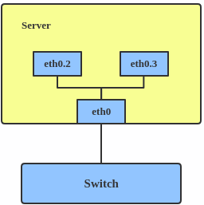

::

  ip link add link eth0 name eth0.2 type vlan id 2
  ip link add link eth0 name eth0.3 type vlan id 3

MACVLAN Interface
+++++++++++++++++

With VLAN, multiple interfaces can be created on top of a single one and packages can be filtered based on VLAN tags. With MACVLAN, multiple interfaces with different Layer 2 (MAC) addresses can be created on top of a single one.

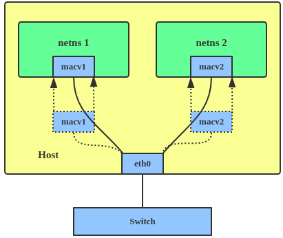

In the meanwhile, MACVLAN supports several different modes:

- private : doesn’t allow communication between MACVLAN instances on the same physical interface;
- vepa    : virtual ethernet port aggregator, data from one MACVLAN instance to the other on the same physical interface is transmitted over the physical interface;
- bridge  : all endpoints are directly connected to each other with a simple bridge via the physical interface (the default mode);
- passthru: allows a single VM to be connected directly to the physical interface;
- source  : filter traffic based on a list of allowed source MAC addresses;

**Examples:**

::

  ip link add macvlan1 link eth0 type macvlan mode bridge
  ip link add macvlan2 link eth0 type macvlan mode bridge
  ip netns add net1
  ip netns add net2
  ip link set macvlan1 netns net1
  ip link set macvlan2 netns net2

VXLAN Interface
+++++++++++++++

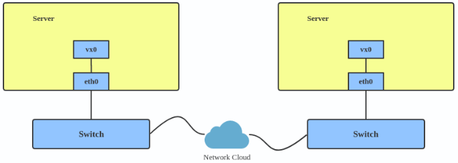

::

  ip link add vx0 type vxlan id 100 local 1.1.1.1 remote 2.2.2.2 dev eth0 dstport 4789

Linux Bridge
++++++++++++

Simply put, a bridge is a layer two device that is used to join two (Ethernet) networks together to form a single larger network. Why is this useful? Imagine a business spread across two different sites each with it’s own LAN. Without an interconnection between the two networks machines on one LAN couldn’t communicate with machines on the other. This can be fixed by installing a bridge between the two sites which will forward packets from one LAN to the other effectively making the two LANs into one large network.

Bridges may or may not learn about the hosts connected to the networks they are bridging. A basic transparent bridge will just pass all packets arriving on it’s input port out the output port(s). This strategy is simple but it can be very wasteful and potentially expensive if the bridge link is charged on the amount of data that passes across it. A better solution is to use a learning bridge that will learn the MAC addresses of hosts on each connected network and only put packets on the bridge when the required. Note that in many respects a learning bridge is much like a regular Ethernet switch which is why bridges as a piece of real hardware have all but disappeared.

Bridge Utilities
~~~~~~~~~~~~~~~~

In the modern network switches have largely made bridges obsolete but the concept of the bridge is still very useful in the virtual world. By installing the package "bridge-utils" on any mainstream Linux machine the you get the ability to create virtual bridges with commands such as:

::

  brctl addbr br0

This would create a virtual bridge called "br0". You can then add interfaces to the bridge like this:

::

  brctl addif br0 eth0
  brctl addif br0 eth1

This adds two Ethernet ports "eth0" and "eth1" to the bridge. If these are physical ports then this set up has linked the two networks connected to these ports at layer two and packets will flow between them. Linux has built in support for filtering the packets passing across the bridge using the user space tool "ebtables" (Ethernet bridge tables) which is similar to "iptables".

You can see the configuration of virtual bridges using the command:

::

  brctl show

Finally you can remove an interface and delete a bridge like this:

::

  brctl delif br0 eth0
  brctl delbr br0

iproute2 Bridges
~~~~~~~~~~~~~~~~

The examples above use the brctl command from the bridge-utils package but that has now been superseded by the newer iproute2 utility which can also create bridges. To create a bridge with iproute2 use the following command:

::

  ip link add br0 type bridge
  ip link show

The second show command just displays the link information which you can use to confirm the bridge has been created. To add an interface to the bridge (know as enslaving it) use a command like this:

::

  ip link set ep1 master br0

This adds the interface ep1 to the bridge br0 (the interfaces ep1 and ep2 are just a veth pair). The output of and ip link show command would now look something like this:

::

  1: lo: <LOOPBACK,UP,LOWER_UP> mtu 65536 qdisc noqueue state UNKNOWN mode DEFAULT group default
   link/loopback 00:00:00:00:00:00 brd 00:00:00:00:00:00
  2: eth0: <BROADCAST,MULTICAST,UP,LOWER_UP> mtu 1500 qdisc pfifo_fast state UP mode DEFAULT group default qlen 1000
   link/ether 08:00:27:4a:5e:e1 brd ff:ff:ff:ff:ff:ff
  4: ep2: <BROADCAST,MULTICAST> mtu 1500 qdisc noop state DOWN mode DEFAULT group default qlen 1000
   link/ether fa:d3:ce:c3:da:ad brd ff:ff:ff:ff:ff:ff
  5: ep1: <BROADCAST,MULTICAST> mtu 1500 qdisc noop master br0 state DOWN mode DEFAULT group default qlen 1000
   link/ether e6:80:a3:19:2c:10 brd ff:ff:ff:ff:ff:ff
  6: br0: <BROADCAST,MULTICAST> mtu 1500 qdisc noop state DOWN mode DEFAULT group default
   link/ether e6:80:a3:19:2c:10 brd ff:ff:ff:ff:ff:ff

Notice that the ep1 interface shows br0 as it's master. To then remove or release the ep1 interface from the bridge:

::

  ip link set ep1 nomaster

And finally to delete the bridge:

::

  ip link delete br0

TUN/TAP Devices
+++++++++++++++

Typically a network device in a system, for example eth0, has a physical device associated with it which is used to put packets on the wire. In contrast a TUN or a TAP device is entirely virtual and managed by the kernel. User space applications can interact with TUN and TAP devices as if they were real and behind the scenes the operating system will push or inject the packets into the regular networking stack as required making everything appear as if a real device is being used.

You might wonder why there are two options, surely a network device is a network device and that’s the end of the story. That’s partially true but TUN and TAP devices aim to solve different problems.

TUN Interfaces
~~~~~~~~~~~~~~

TUN devices work at the IP level or layer three level of the network stack and are usually point-to-point connections. A typical use for a TUN device is establishing VPN connections since it gives the VPN software a chance to encrypt the data before it gets put on the wire. Since a TUN device works at layer three it can only accept IP packets and in some cases only IPv4. If you need to run any other protocol over a TUN device you're out of luck. Additionally because TUN devices work at layer three they can't be used in bridges and don't typically support broadcasting

TAP Interfaces
~~~~~~~~~~~~~~

TAP devices, in contrast, work at the Ethernet level or layer two and therefore behave very much like a real network adaptor. Since they are running at layer two they can transport any layer three protocol and aren't limited to point-to-point connections. TAP devices can be part of a bridge and are commonly used in virtualization systems to provide virtual network adaptors to multiple guest machines. Since TAP devices work at layer two they will forward broadcast traffic which normally makes them a poor choice for VPN connections as the VPN link is typically much narrower than a LAN network (and usually more expensive).

Managing Virtual Interfaces
~~~~~~~~~~~~~~~~~~~~~~~~~~~

It really couldn't be simpler to create a virtual interface:

::

  ip tuntap add name tap0 mode tap
  ip link show

The above command creates a new TAP interface called tap0 and then shows some information about  the device. You will probably notice that after creating the tap0 device reports that it is in the down state. This is by design and it will come up only when something binds it. The output of the show command will look something like this:

::

  1: lo: <LOOPBACK,UP,LOWER_UP> mtu 65536 qdisc noqueue state UNKNOWN mode DEFAULT group default
   link/loopback 00:00:00:00:00:00 brd 00:00:00:00:00:00
  2: eth0: <BROADCAST,MULTICAST,UP,LOWER_UP> mtu 1500 qdisc pfifo_fast state UP mode DEFAULT group default qlen 1000
   link/ether 08:00:27:4a:5e:e1 brd ff:ff:ff:ff:ff:ff
  3: tap0: <BROADCAST,MULTICAST> mtu 1500 qdisc noop state DOWN mode DEFAULT group default qlen 500
   link/ether 36:2b:9d:5c:92:78 brd ff:ff:ff:ff:ff:ff

To remove a TUN/TAP interface just replace "add" in the creation command with "del". Note that you have to specify the mode when deleting, presumably you can create both a tun and a tap interface with the same name.

veth Pairs
++++++++++

A pair of connected interfaces, commonly known as a veth pair, can be created to act as virtual wiring. Essentially what you are creating is a virtual equivalent of a patch cable. What goes in one end comes out the other. The command to create a veth pair is a little more complicated than some:

::

  ip link add ep1 type veth peer name ep2

This will create a pair of linked interfaces called ep1 and ep2 (ep for Ethernet pair, you probably want to choose more descriptive names). When working with OpenStack, especially on a single box install, it's common to use veth pairs to link together the internal bridges. It is also possible to add IP addresses to the interfaces, for example:

::

  ip addr add 10.0.0.10 dev ep1
  ip addr add 10.0.0.11 dev ep2

Now you can use ip address show to check the assignment of IP addresses which will output something like this:

::

  1: lo: <LOOPBACK,UP,LOWER_UP> mtu 65536 qdisc noqueue state UNKNOWN group default
   link/loopback 00:00:00:00:00:00 brd 00:00:00:00:00:00
   inet 127.0.0.1/8 scope host lo
   valid_lft forever preferred_lft forever
   inet6 ::1/128 scope host
   valid_lft forever preferred_lft forever
  2: eth0: <BROADCAST,MULTICAST,UP,LOWER_UP> mtu 1500 qdisc pfifo_fast state UP group default qlen 1000
   link/ether 08:00:27:4a:5e:e1 brd ff:ff:ff:ff:ff:ff
   inet 192.168.1.141/24 brd 192.168.1.255 scope global eth0
   valid_lft forever preferred_lft forever
   inet6 fe80::a00:27ff:fe4a:5ee1/64 scope link
   valid_lft forever preferred_lft forever
  4: ep2: <BROADCAST,MULTICAST> mtu 1500 qdisc noop state DOWN group default qlen 1000
   link/ether fa:d3:ce:c3:da:ad brd ff:ff:ff:ff:ff:ff
   inet 10.0.0.11/32 scope global ep2
   valid_lft forever preferred_lft forever
  5: ep1: <BROADCAST,MULTICAST> mtu 1500 qdisc noop state DOWN group default qlen 1000
   link/ether e6:80:a3:19:2c:10 brd ff:ff:ff:ff:ff:ff
   inet 10.0.0.10/32 scope global ep1
   valid_lft forever preferred_lft forever

Using a couple of parameters on the ping command shows us the veth pair working:

::

  ping -I 10.0.0.10 -c1 10.0.0.11
  PING 10.0.0.11 (10.0.0.11) from 10.0.0.10 : 56(84) bytes of data.
  64 bytes from 10.0.0.11: icmp_seq=1 ttl=64 time=0.036 ms
  --- 10.0.0.11 ping statistics ---
  1 packets transmitted, 1 received, 0% packet loss, time 0ms
  rtt min/avg/max/mdev = 0.036/0.036/0.036/0.000 ms

The -I parameter specifies the interface that should be used for the ping. In this case the 10.0.0.10 interface what chosen which is a pair with 10.0.0.11 and as you can see the ping is there and back in a flash. Attempting to ping anything external fails since the veth pair is essentially just a patch cable (although ping'ing eth0 works for some reason).

Others
++++++

There exist quite a few other interface types which are not used frequently, such as team device, IPVLAN, MACsec, etc.. Google them directly.

Linux Switching with Demo
-------------------------

Switching in software on Linux is one of the important parts when using virtualization technologies like KVM or LXC. Typical hosts do not provide one or more physical adapters for each NIC of a virtual machine in KVM or per container when using LXC. Something else must take the part to interconnect the virtual network interfaces.

The software switching classical tool is the linuxbridge, which is available in the Linux kernel for a long time. The frontend to manage the linuxbridge is brctl. The newer tool is the openvswitch (at http://openvswitch.org/). The main frontend is ovs-vsctl.

tap interfaces
++++++++++++++

Linux tap interfaces created with ip tuntap cannot be used to attach network namespaces to linuxbridges or the openvswitch.

veth pair
+++++++++

The simple solution to connect two network namespaces is the usage of one veth pair:

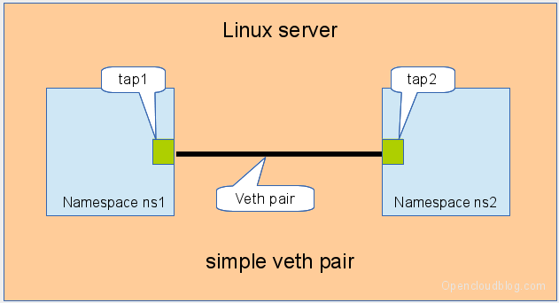

**The command sequence are as below:**

::

  # add the namespaces
  ip netns add ns1
  ip netns add ns2
  # create the veth pair
  ip link add tap1 type veth peer name tap2
  # move the interfaces to the namespaces
  ip link set tap1 netns ns1
  ip link set tap2 netns ns2
  # bring up the links
  ip netns exec ns1 ip link set dev tap1 up
  ip netns exec ns2 ip link set dev tap2 up
  # now assign the ip addresses

linux bridge and veth Paris
+++++++++++++++++++++++++++

When more than two network namespaces (or KVM or LXC instances) must be connected a switch should be used. Linux offers as one solution the well known linux bridge.

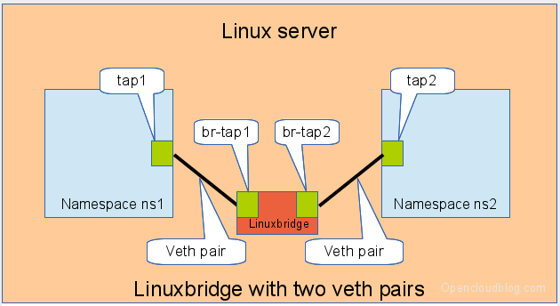

**The commands to create this setup are:**

::

  # add the namespaces
  ip netns add ns1
  ip netns add ns2
  # create the switch
  BRIDGE=br-test
  brctl addbr $BRIDGE
  brctl stp   $BRIDGE off
  ip link set dev $BRIDGE up
  #
  #### PORT 1
  # create a port pair
  ip link add tap1 type veth peer name br-tap1
  # attach one side to linuxbridge
  brctl addif br-test br-tap1
  # attach the other side to namespace
  ip link set tap1 netns ns1
  # set the ports to up
  ip netns exec ns1 ip link set dev tap1 up
  ip link set dev br-tap1 up
  #
  #### PORT 2
  # create a port pair
  ip link add tap2 type veth peer name br-tap2
  # attach one side to linuxbridge
  brctl addif br-test br-tap2
  # attach the other side to namespace
  ip link set tap2 netns ns2
  # set the ports to up
  ip netns exec ns2 ip link set dev tap2 up
  ip link set dev br-tap2 up
  #

openvswitch and two veth pairs
++++++++++++++++++++++++++++++

Another solution is to use the openvswitch instead of the "old" linuxbrige. The configuration is nearly the same as for the linuxbridge.

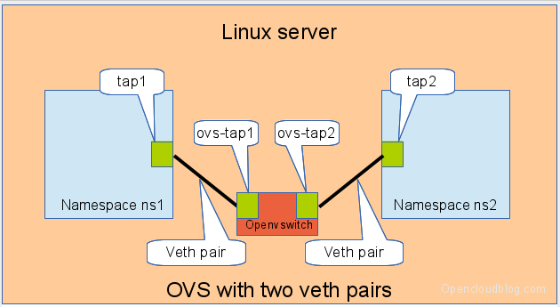

**The commands to create this setup are:**

::

  # add the namespaces
  ip netns add ns1
  ip netns add ns2
  # create the switch
  BRIDGE=ovs-test
  ovs-vsctl add-br $BRIDGE
  #
  #### PORT 1
  # create a port pair
  ip link add tap1 type veth peer name ovs-tap1
  # attach one side to ovs
  ovs-vsctl add-port $BRIDGE ovs-tap1
  # attach the other side to namespace
  ip link set tap1 netns ns1
  # set the ports to up
  ip netns exec ns1 ip link set dev tap1 up
  ip link set dev ovs-tap1 up
  #
  #### PORT 2
  # create a port pair
  ip link add tap2 type veth peer name ovs-tap2
  # attach one side to ovs
  ovs-vsctl add-port $BRIDGE ovs-tap2
  # attach the other side to namespace
  ip link set tap2 netns ns2
  # set the ports to up
  ip netns exec ns2 ip link set dev tap2 up
  ip link set dev ovs-tap2 up
  #

openvswitch and two openvswitch ports
+++++++++++++++++++++++++++++++++++++

Another solution is to use the openvswitch and make use of the openvswitch internal ports. This avoids the usage of the veth pairs, which must be used in all other solutions.

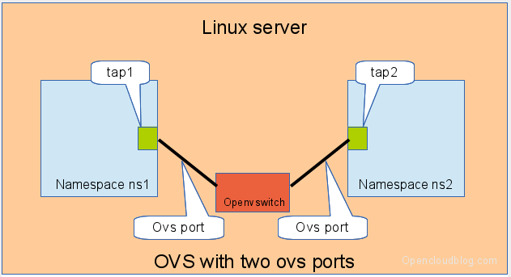

**The commands to create this setup are:**

::

  # add the namespaces
  ip netns add ns1
  ip netns add ns2
  # create the switch
  BRIDGE=ovs-test
  ovs-vsctl add-br $BRIDGE
  #
  #### PORT 1
  # create an internal ovs port
  ovs-vsctl add-port $BRIDGE tap1 -- set Interface tap1 type=internal
  # attach it to namespace
  ip link set tap1 netns ns1
  # set the ports to up
  ip netns exec ns1 ip link set dev tap1 up
  #
  #### PORT 2
  # create an internal ovs port
  ovs-vsctl add-port $BRIDGE tap2 -- set Interface tap2 type=internal
  # attach it to namespace
  ip link set tap2 netns ns2
  # set the ports to up
  ip netns exec ns2 ip link set dev tap2 up

**Notes**: OVS internal port can be used to refer to the Open vSwitch itself, in other words, an IP can be assigned to it. With this feature, the host could still be accessible from outside even if all physical port are added to OVS bridge. For example, we can create an internal port(VLAN configured) and assign an IP for it, then we can access the host from outside within the same VLAN:

::

  ovs-vsctl add-port br0 vlan1000 -- set Interface vlan1000 type=internal
  ovs-vsctl set port vlan1000 tag=1000
  ip addr add 192.168.10.10/24 dev vlan1000
  ifup vlan1000

Connect 2 x Open vSwitch
++++++++++++++++++++++++

To connect 2 x Open vSwitch together, we need to use patch port:

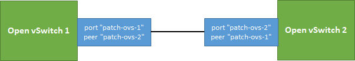

::

  ovs-vsctl add-port ovs1 patch-ovs-1
  ovs-vsctl set interface patch-ovs-1 type=patch
  ovs-vsctl set interface patch-ovs-1 options:peer=patch-ovs-2

  ovs-vsctl add-port ovs1 patch-ovs-2
  ovs-vsctl set interface patch-ovs-2 type=patch
  ovs-vsctl set interface patch-ovs-2 options:peer=patch-ovs-1

======================
OpenStack Network Tips
======================

NIC/Device Naming
-----------------

**Network Device Prefix:**

- qvo: veth pair openvswitch side
- qvb: veth pair bridge side
- qbr: bridge
- qr: l3 agent managed port, router side
- qg: l3 agent managed port, gateway side

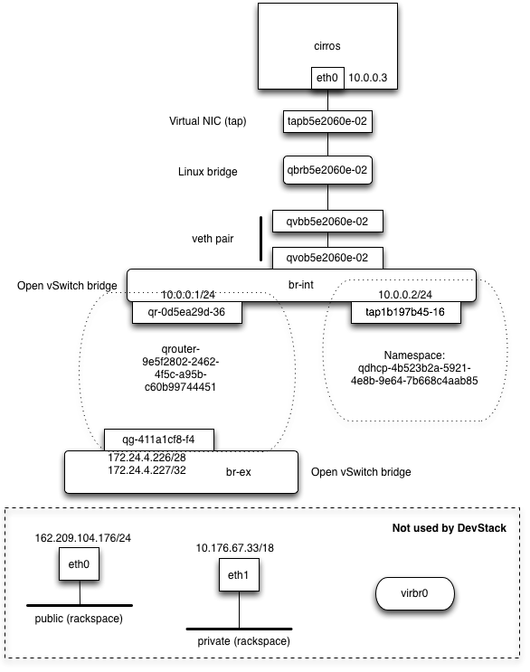

Classic Network Node Components
-------------------------------

Refer to: https://docs.openstack.org/liberty/networking-guide/scenario-classic-ovs.html

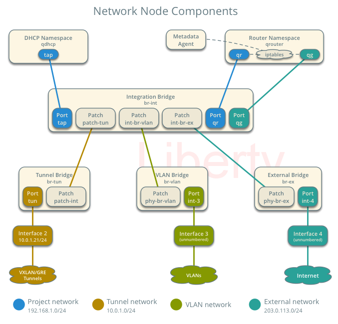

Traffic Flow
------------

North/South
+++++++++++

Between projects and external.

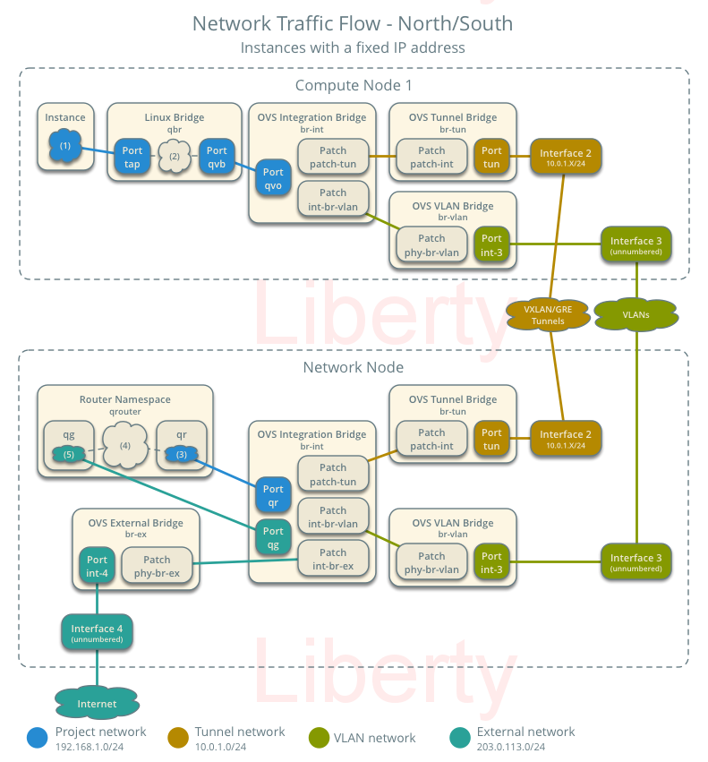

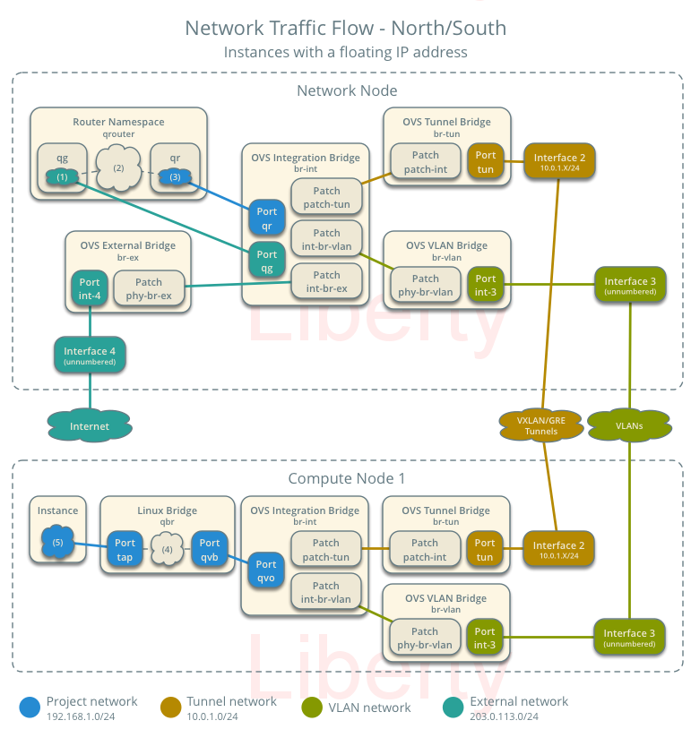

East/West
+++++++++++

Between projects.

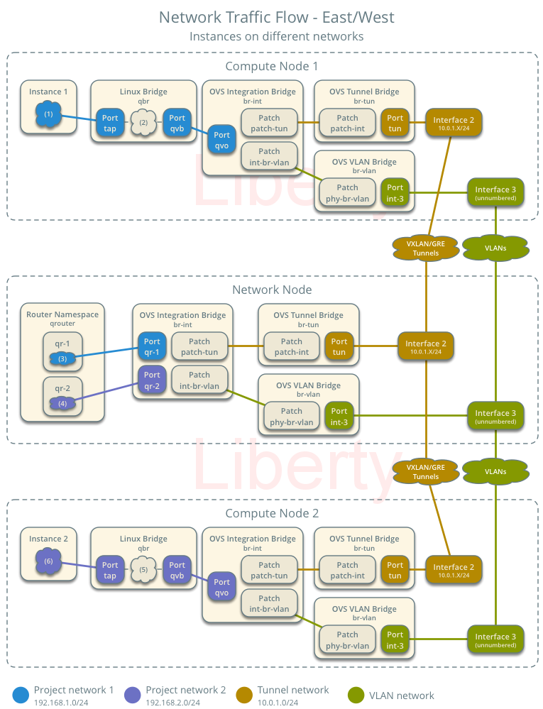

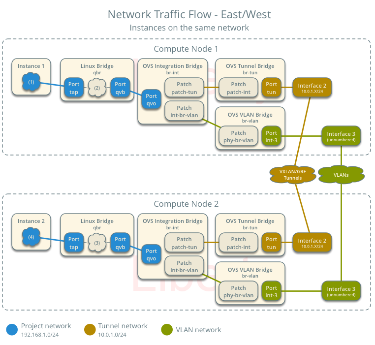

Wonderful Documents
-------------------

`Everything you need to know to get started with Neutron
<http://superuser.openstack.org/articles/everything-you-need-to-know-to-get-started-with-neutron-f90e2797-26b7-4d1c-84d8-effef03f11d2/>`_

  In this tutorial, learn how to create multiple networks and subnets and then spawn multiple virtual machines across these networks and verify network connectivity for static IP addresses.

================================
Open vSwitch Commands Cheatsheet
================================

Overview
--------

The Open vSwitch Database Management Protocol (OVSDB) is an OpenFlow configuration protocol that is designed to manage Open vSwitch implementations. It is used to perform management and configuration operations on OVS instances(OVSDB does not perform per-flow operations, leaving those instead to OpenFlow).

Below is the diagram showing the main components and interfaces of OVS(refer to https://tools.ietf.org/id/draft-pfaff-ovsdb-proto-02.html):

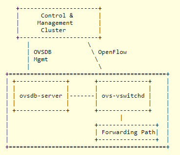

Actually, configuring an OVS instance is similar as operating a database - once the tables, records, and columns are identified, changes can be made easily.

- Tables: man ovs-vsctl -> locate "Identifying Tables, Records, and Columns"
- Commands: man ovs-vsctl -> locate "Database Command Syntax"

Samples
+++++++

Target: Change the vlan of a port.

Steps:

1. man ovs-vsctl -> locate "Identifying Tables, Records, and Columns" -> Find table name "Port";
2. man ovs-vsctl -> locate "Database Command Syntax" -> Find "list" command;
3. Query the details of the port as below:

   ::

     # ovs-vsctl list Port vlan305
     ...
     name                : "vlan305"
     tag                 : 305
     trunks              : []
     vlan_mode           : []
     ...

4. man ovs-vsctl -> locate "Database Command Syntax" -> Find "set" command;
5. Perform the change:

   ::

     # table: Port
     # record: vlan305
     # column: tag
     # ovs-vsctl set Port vlan305 tag=310

VLAN
----

Notes: OVS port are in trunk mode by default and all VLANs are allowed.

- Add: ovs-vsctl set port vnet0 tag=100
- Remove: ovs-vsctl remove port vnet0 tag 100
- Trunk: ovs-vsctl set port vnet0 trunks=20,30,40
- Native VLAN: ovs-vsctl set port vnet0 vlan_mode=native-untagged

Spanning Tree
-------------

- Query: ovs-vsctl get bridge <bridge name> stp_enable
- Enable: ovs-vsctl set bridge <bridge name> stp_enable=true
- Disable: ovs-vsctl set bridge <bridge name> stp_enable=false
- Set priority: ovs−vsctl set bridge br0 other_config:stp-priority=0x7800
- Set cost: ovs−vsctl set port eth0 other_config:stp-path-cost=10

Bridge
------

- Add: ovs-vsctl add-br br0
- Remove: ovs-vsctl del-br br0
- List: ovs-vsctl list-br
- Set: ovs-vsctl set bridge br0 other-config:disable-in-band=true

Port
----

- Add: ovs-vsctl add-port br0 port1
- Remove: ovs-vsctl del-port port1
- List: ovs-vsctl list-ports br0
